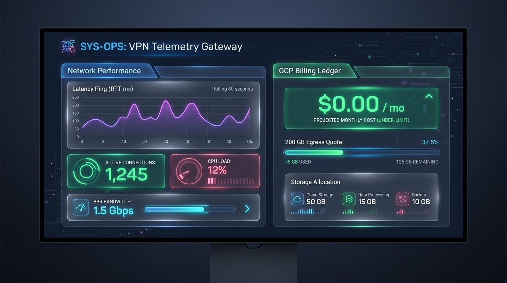

<div align="center">
  

  <br>

  <h1>🌩️ Anycast WebSocket Gateway: Resilient, Cost-Optimized Edge Proxy on GCP</h1>

  <p><b>An elite, production-grade, and resilient VLESS-over-WebSocket (VLESS-WS) VPN chassis fronted by Nginx and routed through Cloudflare's global Anycast CDN back to an Always-Free Google Cloud VM.</b></p>

  <a href="LICENSE"></a>
  <a href="https://cloud.google.com/free"></a>
  <a href="https://www.cloudflare.com"></a>
  <a href="https://jules.google"></a>
  <a href="AGENTS.md"></a>
  <a href="https://github.com/AliAziziDH/anycast-vless-chassis/stargazers"></a>
</div>

---

This is a battle-tested, reverse-engineered infrastructure template optimized specifically to maintain robust pacing over unstable transcontinental routes and achieve ultra-low latencies.

---

## 🚀 Architectural Advantages

*   **Google BBR Congestion Control:** Kernel-level bottleneck bandwidth modeling to stabilize packet pacing and mitigate throughput decay over lossy, high-latency transcontinental links.
*   **Zero-Buffer Real-Time WebSockets:** Optimizing duplex WebSocket socket options (`proxy_buffering off;` and `tcp_nodelay on;`) to eliminate frame-accumulation latency in stateful streams.
*   **HTTPS Port 443 Camouflage:** All generated nodes are bound to standard **HTTPS Port 443**, blending your handshake frames seamlessly with regular encrypted web traffic.
*   **Decentralized Anycast CDN Fronting:** Origin shielding. Deploying a globally distributed Anycast Edge network to terminate handshakes geographically closer to clients, secure the VM backend from active scanner probes, and absorb volumetric traffic surges.
*   **100% Free Forever ($0 Cloud Hosting):** Fully optimized to run inside Google Cloud's permanent **Always Free Tier** boundaries.

---

## ⚙️ Modular Edge Customization & Performance Tuning

To prevent static signature mapping of public gateway files, the repository serves as a customizable, modular template. Users can easily plug in their own scanned CDN edge IPs, DNS templates, and upstream proxy configurations for localized performance scaling.

To achieve maximum speed:
1.  **Fork this repository** to create your own isolated workspace.
2.  Run a local client-side scanner on your device (such as [XIU2/CloudflareSpeedTest](https://github.com/XIU2/CloudflareSpeedTest) or [CrimsonCF](https://github.com/amir0zx/CrimsonCF)) to find clean, performant Anycast IP addresses for your specific network topology.
3.  Replace the placeholder Anycast CDN IPs in your client app with your scanned fast IPs.
4.  Forking ensures you can continuously update, merge, and expand on this foundation with your own routing rules!

---

## 📊 Live Observability & Telemetry Dashboard

To give you complete situational awareness and billing safety, the chassis is equipped with an integrated **Financial & Performance Observability Dashboard** served directly from Nginx via your secure tunnel.

<div align="center">
  
</div>

### 🖥️ Key Interface Components:

| Component | Metric Captured | Source Mechanism |
|---|---|---|
| **Active Streams** | Live count of concurrent WebSocket tunnels | Local Nginx loopback `stub_status` query |
| **Minimum RTT Graph** | Live rolling 60s latency ping history | Parsed kernel TCP metrics via socket statistics (`ss -ti`) |
| **GCP Billing Ledger** | Live projection of active disk and egress costs | Dynamic cost calculator matched to GCP pricing rules |
| **Egress Quota progress** | Real-time byte consumption against 200 GB limit | Pipe-delimited access logs (`vpn_access.log`) aggregator |

---

## 🛠️ Step-by-Step Deployment (GCP Always Free Tier)

### 1. Prerequisites
*   A Google Cloud Platform account.
*   A GitHub account to fork this repository.

### 2. Launching the Server
Open your **Google Cloud Shell** and execute these commands:

```bash
# Clone your forked repository
git clone https://github.com/YOUR_GITHUB_USERNAME/anycast-vless-chassis.git
cd anycast-vless-chassis

# Make deployment files executable
chmod +x deploy_gcp.sh

# Run the automated deployment script
./deploy_gcp.sh
```

The orchestrator script dynamically pulls your project parameters, configures GCP security firewall rules, provisions an `e2-micro` VM with a standard 10 GB persistent disk, sets up BBR, establishes a secure Cloudflare Tunnel, and prints your **Base64-encoded subscription link** directly on your terminal!

---

## 📈 Understanding GCP Always-Free Tier Limits

Staying within GCP's Always Free Tier limits is vital to maintain a $0/month cost profile. Our telemetry daemon dynamically calculates your projected billing using these exact free boundaries:

1.  **Compute:** One non-preemptive `e2-micro` VM instance per month in eligible US regions (us-central1, us-east1, or us-west1).
2.  **Storage:** Up to **30 GB of Standard Persistent Disk (PD)** storage per month is completely free.
3.  **Network Egress:** Up to **200 GB of Standard Tier network egress** per month is completely free. Standard Tier egress routes traffic over the public internet rather than Google's private global backbone network, making it free under GCP's limits.

### ⚠️ Monthly Cost Formula Integrated inside the API:
$$\text{Projected Monthly Cost} = (\text{Egress GB} - 200\,\text{GB}) \times \$0.085/\text{GB} + (\text{Root Disk Size} - 30\,\text{GB}) \times \$0.040/\text{GB}$$

*Always configure a **$1.00 GCP Billing Alert** in your Google Cloud Billing console to act as a permanent financial safety switch.*

---

## 🤖 Agent-Native Development (`AGENTS.md`)

This repository is engineered as an **Agent-Native Codebase** conforming to the universal `AGENTS.md` specification. It contains structured, declarative workspace rules that allow AI coding agents (such as Google's **Jules** or **Aider**) to autonomously maintain, refactor, and self-heal this codebase.

*   **Declarative Setup:** All installation commands and test hooks are documented inside `AGENTS.md` to prevent AI context drift.
*   **Zero-Downtime Live Updates:** All telemetry upgrades are deployed using our hotpatcher (`hotpatch_monitoring.sh`), gracefully reloading Nginx configurations without dropping any active WebSocket streams.

---

## 🔗 Elite Reference Tools

This chassis integrates seamlessly with premier digital resilience scanners:
*   [MortezaBashsiz/CFScanner](https://github.com/MortezaBashsiz/CFScanner) - The legendary Cloudflare IP scanner.
*   [XIU2/CloudflareSpeedTest](https://github.com/XIU2/CloudflareSpeedTest) - Fast, lightweight CDN edge speed tester.
*   [amir0zx/CrimsonCF](https://github.com/amir0zx/CrimsonCF) - Layer 4 TCP connection scanner.
*   [payeh/IPCleanScanner](https://github.com/payeh/IPCleanScanner) - Clean IP scanner and tester for v2rayN.
*   [bia-pain-bache/BPB-Warp-Scanner](https://github.com/bia-pain-bache/BPB-Warp-Scanner) - Cross-platform Warp endpoint optimizer.

---

*Designed with love, fail-fast engineering, and elite cloud-native standards.* 🕊️
