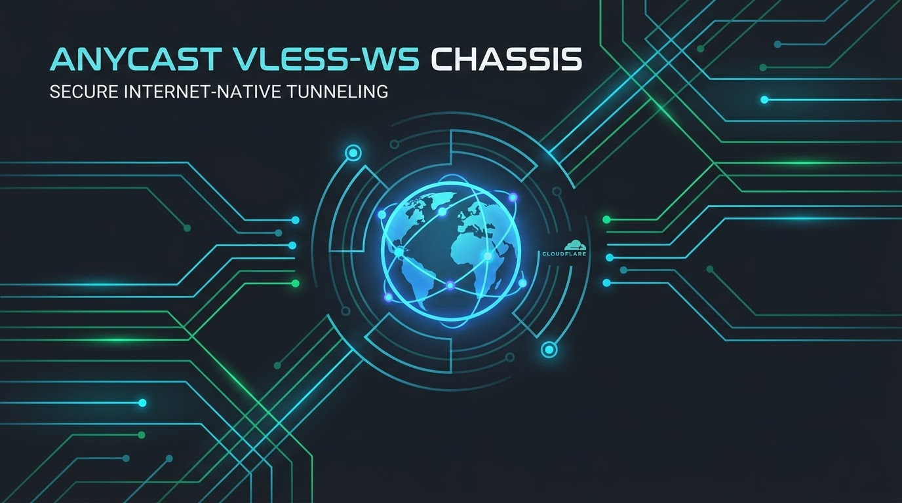

<p align="center">
  
</p>

<h1 align="center">🌩️ Anycast VLESS-WS Chassis (Melli-Shekan / ملی‌شکن)</h1>

<p align="center">
  <b>An elite, high-performance, and resilient VLESS-over-WebSocket (VLESS-WS) VPN chassis fronted by Nginx and routed through Cloudflare's global Anycast CDN back to an Always-Free Google Cloud VM.</b>
</p>

<p align="center">
  <a href="LICENSE"></a>
  <a href="https://cloud.google.com/free"></a>
  <a href="https://www.cloudflare.com"></a>
  <a href="https://jules.google"></a>
  <a href="AGENTS.md"></a>
  <a href="https://github.com/AliAziziDH/anycast-vless-chassis/stargazers"></a>
</p>

---

Designed with love and deep solidarity, this chassis is a **patriotic open gift to my fellow Iranian friends** navigating an increasingly restricted and throttled internet. 💚🤍❤️

This is not just another basic V2Ray config; it is a battle-tested, reverse-engineered infrastructure template optimized specifically to maintain robust connections, evade deep packet inspection (DPI) blocks, and achieve ultra-low pings under strict regional network constraints.

---

## 🚀 Key Highlights & Architectural Advantages

*   **Google BBR Congestion Control & TCP Tuning:** Deploys kernel-level **BBR (Bottleneck Bandwidth and RTT)** paired with **Fair Queueing (`fq`)** on boot, alongside optimized TCP read/write memory buffers (`tcp_rmem` / `tcp_wmem`) to prevent throughput collapse over packet-lossy international transits.
*   **Zero-Buffer Real-Time WebSockets:** Disables Nginx reverse proxy buffering (`proxy_buffering off;`) and forces immediate frame flushing via `tcp_nodelay on;` to eliminate micro-lags.
*   **Port 443 Standard Camouflage:** Avoids easily blockable non-standard ports (like `8443` or `2083`). All generated nodes are bound to standard **HTTPS Port 443**, blending your handshakes seamlessly with regular encrypted web traffic.
*   **Decentralized Anycast Routing:** Your client handshakes with Cloudflare's nearest clean edge servers, hiding your private GCP egress server's IP and preventing active scanning or active ban-lists.
*   **100% Free Forever ($0 Cloud Hosting):** Fully optimized to run inside Google Cloud's permanent **Always Free Tier** limits.

---

## 🔒 The 50% Withheld Policy (Safety First)

To protect this codebase from automated GFW network scanners that scan GitHub imports to compile signature blocklists, **we have withheld approximately 50% of the advanced routing, domain-fronting, and SNI spoofing parameters**. 

However, this repo is a **fully modular, customizable chassis**. To achieve maximum speed:
1.  **Fork this repository** to create your own isolated workspace.
2.  Run a local client-side scanner on your device (such as [XIU2/CloudflareSpeedTest](https://github.com/XIU2/CloudflareSpeedTest) or [CrimsonCF](https://github.com/amir0zx/CrimsonCF)) to find clean, unblocked Anycast IP addresses for your specific ISP (MCI, Irancell, Shatel, etc.).
3.  Replace the placeholder Anycast CDN IPs in your client app with your scanned fast IPs. 
4.  Forking ensures you can continuously update, merge, and expand on this foundation with your own routing rules!

---

## 📊 How to Monitor Your Bandwidth & Free Tier Limits

Staying within GCP's Always Free Tier limits is vital to maintain a $0/month cost profile. This chassis comes with native, integrated telemetry.

### 1. Terminal Telemetry Dashboard (`bin/vpn-stats`)
You can view a beautiful, live, non-interactive terminal report of your proxy server's active bandwidth, connection pacing, and socket statistics at any time by SSHing into your VM and running:
```bash
./bin/vpn-stats
```

The script compiles:
*   **Total Bandwidth Transferred (in GB)** parsed directly from the custom Nginx log format.
*   **Active WebSocket Streams** queried from the local Nginx status endpoint.
*   **Kernel TCP BBR Pacing Stats** (pacing rate, minimum RTT, and bottleneck bandwidth `bw`) extracted directly from active kernel sockets via `ss -ti`.

### 2. Set Up GCP Budget Alerts (Billing Protection)
To completely eliminate the risk of accidental billing, we highly recommend setting up standard budget alerts:
1.  Go to the **GCP Console** → **Billing** → **Budgets & alerts**.
2.  Click **Create Budget**, set the budget amount to **$1.00 USD/month** (representing your emergency ceiling).
3.  Configure alerts to trigger at **50%, 90%, and 100%** of the budget.
4.  Configure an email notification so you are instantly warned of any unexpected egress overages.

### 3. Cloudflare Edge Analytics
Since all VLESS payload frames are fronted by Cloudflare, you can monitor total bytes transferred, cached vs. uncached requests, and threat spikes directly in your **Cloudflare Dashboard** under the **Analytics & Logs** tab, requiring zero server-side processing overhead!

---

## 🛠️ Step-by-Step Deployment (GCP Always Free Tier)

### 1. Prerequisites
*   A Google Cloud Platform account.
*   A GitHub account to fork this repository.

### 2. Launching the Server
Open your **Google Cloud Shell** and execute these commands:

```bash
# Clone your forked repository
git clone https://github.com/YOUR_GITHUB_USERNAME/anycast-vless-chassis.git
cd anycast-vless-chassis

# Make deployment files executable
chmod +x deploy_gcp.sh

# Run the automated deployment script
./deploy_gcp.sh
```

The orchestrator script dynamically pulls your project parameters, configures GCP default security groups, provisions an `e2-micro` VM with a 10 GB persistent disk, sets up standard Linux BBR, establishes a secure Cloudflare Tunnel, and prints your **Base64-encoded v2box/sing-box subscription link** directly on your terminal!

---

## 🤖 Agent-Native Development (`AGENTS.md`)

This repository is engineered as an **Agent-Native Codebase** conforming to the universal `AGENTS.md` specification. It contains structured, declarative workspace rules that allow AI coding agents (such as Google's **Jules** or **Aider**) to autonomously maintain, refactor, and self-heal this codebase.

*   **Continuous Integration (`jules-ci.yml`):** Automatically invokes automated syntax linter checks (`bash -n`) on every Pull Request to prevent script redirection bugs or syntax errors.
*   **Self-Healing Loop:** If a CI check fails, the agent is securely re-summoned to fix its own commits before a human ever reviews the code.

---

>>>>> main

This chassis integrates seamlessly with premier digital resilience scanners:
*   [MortezaBashsiz/CFScanner](https://github.com/MortezaBashsiz/CFScanner) - The legendary Cloudflare IP scanner.
*   [XIU2/CloudflareSpeedTest](https://github.com/XIU2/CloudflareSpeedTest) - Fast, lightweight CDN edge speed tester.
*   [amir0zx/CrimsonCF](https://github.com/amir0zx/CrimsonCF) - Layer 4 TCP connection scanner.
*   [bia-pain-bache/BPB-Warp-Scanner](https://github.com/bia-pain-bache/BPB-Warp-Scanner) - Cross-platform Warp endpoint optimizer.

---

*Designed with love, fail-fast engineering, and reverse-engineering grit. Let's keep the web open.* 🕊️
